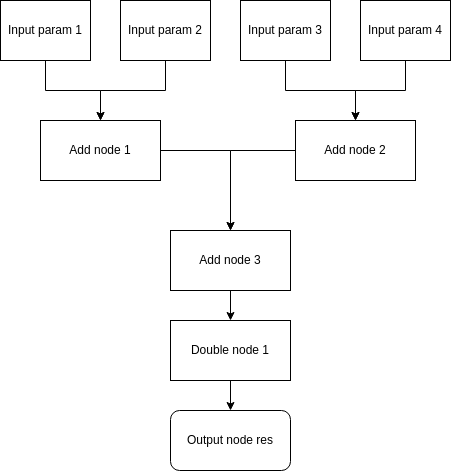

# React and promise based task flow library
Now a lot of features are task flow based. You could break features into a seriese of tasks with order and dependency. For example, to start task C, you have to wait for task A / B and then take their outputs for further process. To express and reuse task flow easily and visually, it could help improve development efficiency. In this repo, task flow and workflow are the same.

## Example
### Simple taskflow expression
Take the task flow below, there are 4 params for input. The task flow would add all 4 params with 3 add nodes and then double the sum with double node. Then the double node's result would be set as task flow's output.



The task flow above could be expressed with react jsx style below,
```typescript
<WorkflowComponent>
    <InputNodeComponent params={["num1", "num2", "num3", "num4"]} />
    <NodeComponent name="add1" gen={addFunc} deps={["num1", "num2"]} />
    <NodeComponent name="add2" gen={addFunc} deps={["num3", "num4"]} />
    <NodeComponent name="add3" gen={addFunc} deps={["add1", "add2"]} />
    <NodeComponent name="double" gen={doubleFunc} deps={["add3"]} />
    <OutputNodeComponent name="res" dep="double" />
</WorkflowComponent>
```
In the jsx code above, there is a container with tag *WorkflowComponent*. Inside the container, there is first a *InputNodeComponent* node with *params* which is a array of name of the input parameters. *NodeComponent* add1 would take num1 and num2 defined within *InputNodeComponent* node to compute the add result with addFunc. After two node add1 and add2 finish work, add3 would take their outputs to run addFunc again with result passed to double node. Finally the result of double node computed by doubleFunc, would be set as task flow's output with alias res. The input parameter and output of a node
 are all refferenced by name.

The jsx code expression above is simple, clear and visual. You don't have to write code with long and chainning expressions.

For each *NodeComponent*, you need to specify a function that could genrate *WorkflowExecutionNode* as below,
```typescript
export interface WorkflowExecutionNode {
    run: (...params: any[]) => any;
    cancel?: () => void;
}
```

### Re-usable taskflow expression
If you want to define a re-usable task flow, then you could define a function with props to wrap the workflow. For example,
```typescript
function ComputationWorkflow(props: WorkflowInputProps) {
    return (<WorkflowComponent {...props}>
            <InputNodeComponent params={["num1", "num2", "num3", "num4"]} />
            <NodeComponent name="add1" gen={addFunc} deps={["num1", "num2"]} />
            <NodeComponent name="add2" gen={addFunc} deps={["num3", "num4"]} />
            <NodeComponent name="add3" gen={addFunc} deps={["add1", "add2"]} />
            <NodeComponent name="double" gen={doubleFunc} deps={["add3"]} />
            <OutputNodeComponent name="res" dep="double" />
        </WorkflowComponent>
    )
}
```
And in a new task flow, reuse the task flow by passsing the params. Then chain the current task flow output to parent taks flow's output node.
```typescript
<WorkflowComponent>
    <InputNodeComponent params={["num1", "num2", "num3", "num4"]} />
    <ComputationWorkflow name="comp" params={["num1", "num2", "num3", "num4"]} />
    <OutputNodeComponent name="res" dep="comp.res" />
</WorkflowComponent>

```
### Taskflow conversion
The example above is about taskflow expression. Once you have defined jsx taskflow, you could use buildJsxWorkflow to generate the task flows with ndoes and its depdencies. For example,
```typescript
const jsxWorkflow = <WorkflowComponent>
    <InputNodeComponent params={["num1", "num2", "num3", "num4"]} />
    <ComputationWorkflow name="comp" params={["num1", "num2", "num3", "num4"]} />
    <OutputNodeComponent name="res" dep="comp.res" />
</WorkflowComponent>
const workflow = buildJsxWorkflow(jsxWorkflow)
```
### Taskflow execution
*createWorkflowExecutor* is for create task flow executor by passing the task flow structure. Call the run method, then wait for the outputs of promise and reference the result by alias . For example,
```typescript
const jsxWorkflow = <WorkflowComponent>
    <InputNodeComponent params={["num1", "num2", "num3", "num4"]} />
    <ComputationWorkflow name="comp" params={["num1", "num2", "num3", "num4"]} />
    <OutputNodeComponent name="res" dep="comp.res" />
</WorkflowComponent>
const workflow = buildJsxWorkflow(jsxWorkflow)
const executor = createWorkflowExecutor(workflow)
executor.run(1, 2, 3, 4).then((res) => {
    console.log(res["res"])
})
```

Please reference *example* and *test* folder for more.
## Development Setup
Please install vscode as IDE
```ini
# install
npm install

# build
npm run build

# test
npm run test

# lint
npm run lint
```
To debug test case, set sourceMap to be true in tsconfig.json, set configuration to be Jest Current File, open test file and run Start Debugging from vscode menu.

## Usage
### Api
****
buildJsxWorkflow(expression: React.ReactElement, addNodeName: boolean = false)
****
Convert the jsx task flow expression to Workflow with node id to name mapping as optional.

**Parameters**:
- **expression** - the jsx expression of the task flow
- **addNodeName** - false by default, if true it would generate id to node name mapping.

**Return**

The task flow instance

****
createWorkflowExecutor(wf: Workflow)
****
Create task flow executor with task flow instance.

**Parameters**

- **wf** - the task flow instance, not the task flow jsx expression

**Return**

The task flow executor instance

****
dumpWorkflow(wf: Workflow)
****

**Parameters**
- **wf** - the task flow instance

**Return**

The code that could generate taks flow instance


### Interfaces
Task flow
```typescript
export interface Workflow {
    inputs: number[];
    zeroDepNodes: number[];
    nodes: WorkflowNode[];
    outputs: Record<number, string>;
    binding: Record<number, number[]>;
    nodeNames?: Record<number, string>;
}
```

Task flow executor
```typescript
export interface WorkflowExecutor {
    cancel() : void;
    run(...params: any[]) : Promise<any>;
    setTimeout(timeout: number) : void;
    reset() : void;
    state() : ExecutionStatus;
    inst(inst: boolean) : void;
    workflow() : Workflow;
    stats(): NodeExecutionStatus[];
}
```
### Components
Below are the basice components. You could create custom task flow components based on theme. Please note that only function components are supported.
``` typescript
declare function NodeComponent(props: NodeProps): any;
declare function WorkflowComponent(props: WorkflowProps): any;
declare function InputNodeComponent(props: InputNodeProps): any;
declare function OutputNodeComponent(props: OutputNodeProps): any;
```

## About react
The library uses *react* to express task flow. It would add extra bundle size. as 1) *react* is included, 2) the jsx taskflow expression would actually be converted to code to create react elements.

If you don't want to depends on *react* and minize the bundle size. You could 1) dump the workflow instance code with *dumpWorkflow* method at runtime or test code. And use the generated code to generate task flow instance, 2) use cli and package target to print the genrated code for pure typescript project. Please reference the workflow target in **./example/client**.
```
    "workflow": "taskflow-react-cli -w ./src/controller/FreWorkflow.tsx -n workflowDef"
```

-w specifies the file path and -n specfies the name of workflow instance exported. Here you need to import unitNodeGenerator from the library, and other node generator functions.


## UI application
The best scenario for task flow is pure data flow. For task that needs to wait for user's input like clicking button, please keep the resolve function. When user clicks the button, you run the resolve function with input needed.

For UI specify task flow, it is recommended to define something like bridge to keep state and callback functions to update UI. Please check **./example/client** for reference.